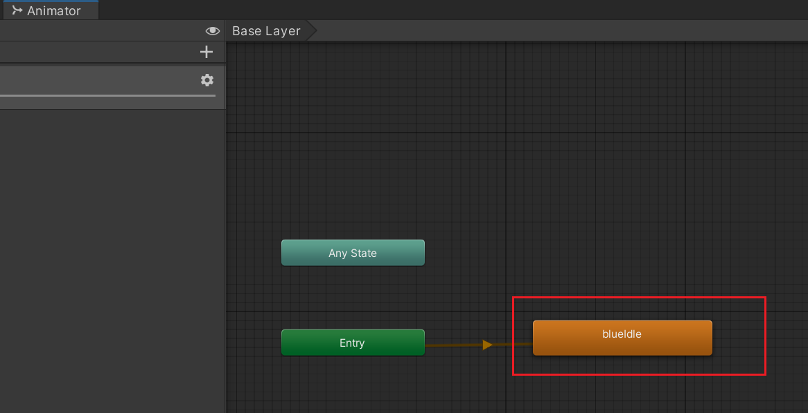
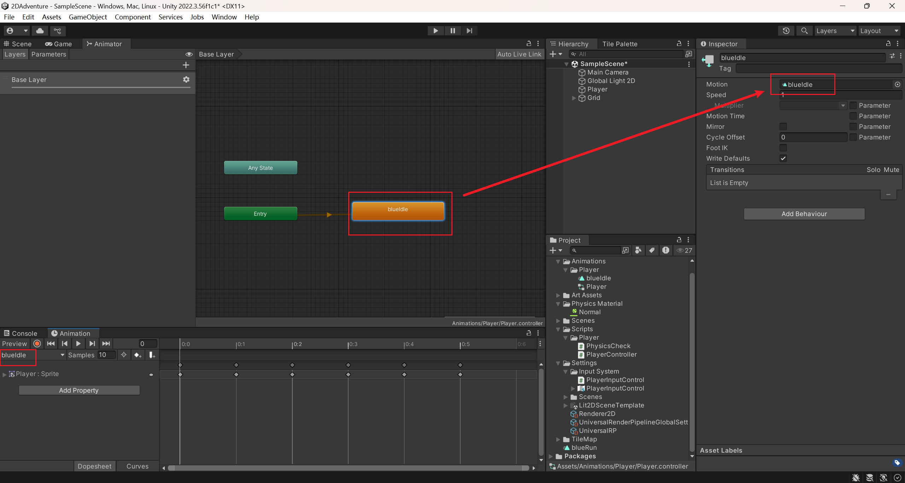
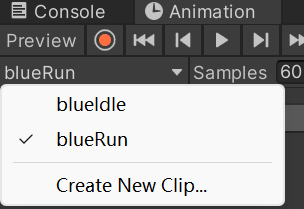
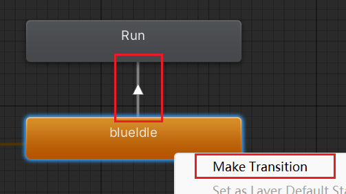
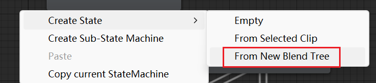

# 2D角色动画

在角色对象中添加Animator组件,然后在Project中创建Animator Controlor,将Animator Controlor拖拽挂载到Animator组件的Controller属性当中.

打开 window -> Animation ->  Animator

和

window -> Animation ->  Animation

在Animation窗口中 create Animation Clip,这时在Animator窗口中会出现对应的动作片段

当前的动作片段中的Motion应用对应的Animation,因此我们还可以直接在Animator中直接创建一个State自己手动和Animation进行相关联

将切割好的精灵图片拖拽到Animation中,进行编辑

[可以在三点中打开 show sample rate 进行采样率的编辑]

如果想要添加新的动画可以在当前动画的下拉菜单中选择Create New Clip...

如果想要不同的动作片段进行切换,可以右键动作片段,选择Make Transition,这时会出现一条线,然后选择要切换到的动作即可

之后就可以点击这个箭头进行切换的条件设置了

如果有非常多的相同类型动作,可以创建混合树来管理这些动作Animation

