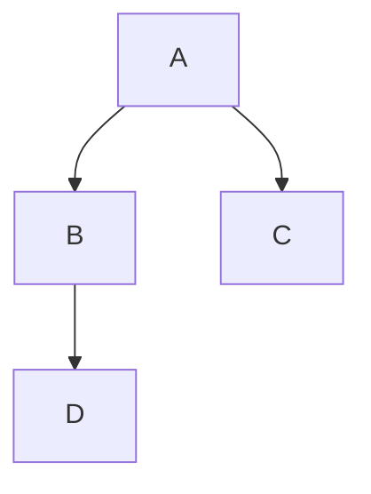
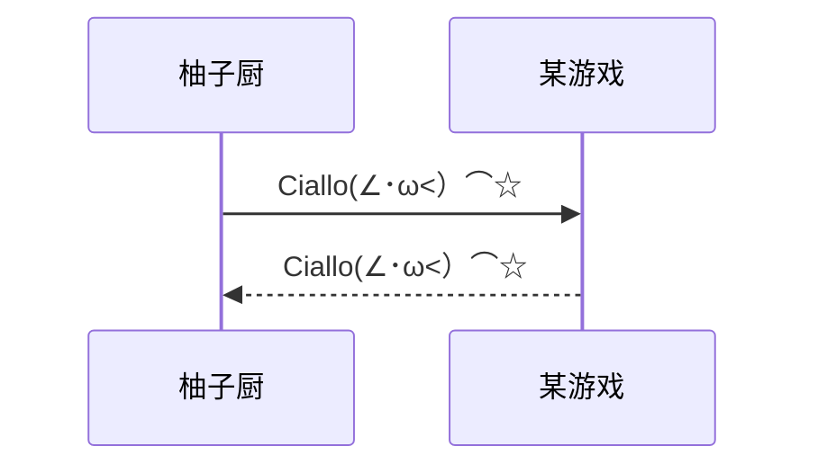

[[toc]]

# markdown使用笔记


# 一.标题

语法: #(一级标题) ##(二级标题)  ###(三级标题) ....

```
1 # 这是一级标题
2 ## 这是二级标题
```

> 更新时间：2024年

::: danger
This is a dangerous warning.
:::


效果:
B站链接图标：[哔哩哔哩](https://www.bilibili.com/)
<sapn class="marker-text">这里是重重点</sapn>
<sapn class="marker-text-highlight">这里是荧光笔</sapn>
<sapn class="marker-evy">这里是尤雨溪的主页样式，鼠标放在我上面看效果</sapn>
<Linkcard url="https://vitepress.yiov.top/" title="Vitepress中文搭建教程" description="https://vitepress.yiov.top/" logo="https://vitepress.yiov.top/logo.png"/>
# 这是一级标题

## 	<font color="yellow">这是二级标题</font>

快捷键:

- ctrl+数字1-6可以快速将选择文本调成对应级别的标题
- ctrl+0可以快速将选择的文本调成普通文本
- ctrl+加号/减号对标题级别进行加减

# 二.段落

## 1.换行

语法:

```
1| enter 大换行
2| shift+enter 小换行
```

效果:

这是第一行
这是第二行

这是一个段落
这是一个段落

## 2.分割线

语法: 

```
---或者***+enter
```

效果

---


# 三.文字显示

## 1.字体

语法:

- 粗体:用一对双星号包裹
- 删除线:用一对双飘号包裹
- 下滑线:用一对u标签包裹
- 斜体:用一对单星号包裹
- 高亮;用一对双等号包裹

代码:

```
1 **这是粗体**
2 ~~这是删除线~~
3 <u>这是下划线</u>
4 *这是斜体*
5 ==这是高亮==
```

效果:

**这是粗体**

~~这是删除线~~

<u>这是下划线</u>

*这是斜体*

==这是高亮==

快捷键:

- **加粗**: ctrl+B
- ~~删除线~~: shift+Alt+5
- <u>下划线</u>:ctrl+u
- *斜体*:ctrl+I

## 2.上下标

代码:

```
1 x^2^ 上标
2 H~2~O 下标
```

效果:

x^2^

H~2~O


# 四.列表

## 1.无序列表

代码:

```
1 * 或者 - 或者 + 加上 空格
2 连续按enter直至退出编辑列表
```

效果:

1.只有同一级别

- 唱
- 跳
- rap

2.子集类

- 一级分类
	- tab键进行二级分类
		- tab键三级分类
	- ctrl+[ 进行降级分类


快捷键:

ctrl+shift+]


## 2.有序列表

代码:

```
1 数字 加 . 加 空格
```

效果:

1. 第一个标题
2. 第二个标题
	1. 子内容1
	2. 子内容2
3. 第三个标题

快捷键: ctrl+shift+[

## 3.任物列表

代码:

```
1 - [ ] 吃早餐
2 - [x] 背单词
```

效果:

- [ ] 吃早餐
- [ ] 背单词


# 五.区块显示

代码:

```
1 > 加 回车
```

> 效果:
>
> >这是最外层区块
> >
> >>这是内层区块
> >>
> >>>这是最内侧区块


# 六.代码显示

## 1.行内代码

> 代码:
>
> ```
> 1 `int a=0;` 
> ```
>
> 效果:
>
> `int a = 0`>
>
> 快捷键:ctrl+shift+`

## 2.代码块

>代码:
>
>```java
>public class test {
>	public static void main(string args[]){
>        System.out.println("hello markdown"); //输出
>    }
>}
>```
>
>
>
>```text
>1 ```js/java/c#/text
>2 内容
>3 ```
>```

>快捷键:`ctrl+shift+k`


# 七.链接

>代码:
>
>```
>1 www.baidu.com 直接输入链接
>2 [百度一下](https://www.baidu.com)  给链接命名
>3 [百度一下](https://www.baidu.com "https://www.baidu.com") 给链接命名,同时设置提示文字
>4 [标题1](##一.标题)   笔记内跳转
>```

>效果:
>
>www.baidu.com
>
>[百度一下](https://www.baidu.com)
>
>[百度一下](https:www.baidu.com)
>
>[标题1](##一.标题)

>快捷键:ctrl+k


# 八.脚注

>说明: 对文本进行解释说明
>
>
>
>代码:
>
>```
>1 [^文本]
>2 [^文本]:解释说明  可以进行跳转
>```

>效果:
>
>这是一个技术[^1]
>
>[^1]: 这是一个好用的笔记


# 九.图片插入

>代码:
>
>```
>
>也可使用html标签格式进行书写
>```

>效果:
>
>
>
>(注:效果路径为d:\\图片\113347564_p0_master1200.jpg^即绝对路径^ 在其他电脑上不显示)

>快捷键:`ctrl+shift+i`


# 十.表格

>代码:
>
>```
>|  1  |  2  |  3  |
>| :---| :---| :---|
>|  4  |  5  |  6  |
>|  7  |  8  |  9  |
>| 10  |  11 |  12 |
>```

>效果:
>
>| `ctrl+shift+enter`表格内换行<br />第二行 | aa   | aa   |
>| ---------------------------------------- | ---- | ---- |
>|                                          | aa   |      |
>|                                          |      |      |
>

>快捷键: `ctrl+T`


# 十一. 表情符号

>代码:
>
>```
>:happy:
>:cry:
>:man:
>```

>效果:
>
>:happy:,  :cry:,  :man:


# 十二. 画图

> 语法: ````Mermaid` 	即可生成一张空白图

## 1.流程图			(graph)

>语法 :
>
>```
>graph TD;			TD表示的是方向(含义是 Top-Down ,由上自下)     可 RL 或 LR 更换方向
>	A-->B;
>	A-->C;
>	B-->D;
>```

效果:



## 2. 时序图			(sequenceDiagram)

>语法:
>
>```
>sequenceDiagram 
>	柚子厨->>某游戏: Ciallo(∠･ω<）⌒☆				->>表示实线
>	某游戏-->>柚子厨: Ciallo(∠･ω<）⌒☆				-->>表示虚线
>```

效果:



## 3. 状态图			(stateDiagram)

>语法:
>
>```
>stateDiagram
>	[*] --> s1			[*]表示开始或结束
>	s1 --> [*]
>```

效果:


## 4. 类图				(classDiagram)

>语法:
>
>```
>classDiagram 
>	Animal <|-- Duck
>	Animal <|-- Fish								<|--表示基础  
>	Animal <|-- Zebra
>	Animal : +int age								+表示pubic
>	Animal : +String name							-表示private
>	Animal : +eat()
>	Animal : +drink()
>	class Duck{
>		+String color
>		+swim()
>		+quack()
>	}
>	class Fish{
>		-int sizeInfeet
>		taste()
>	}
>	class Zebra {
>		
>	}
>```

效果:

```Mermaid
classDiagram 
	Animal <|-- Duck
	Animal <|-- Fish
	Animal <|-- Zebra
	Animal : +int age
	Animal : +String name
	Animal : +eat()
	Animal : +drink()
	class Duck{
		+String color
		+swim()
		+quack()
	}
	class Fish{
		-int sizeInfeet
		-taste()
	}
	class Zebra {
		
	}
```

## 5. 甘特图				(gantt)

>语法:
>
>```
>gantt
>	title 工作计划
>	dateFormat YYYY-MM-DD
>	section 摸鱼计划
>	睡觉			:al, 2024-10-01, 4d
>	吃饭			:after al , 2d
>	
>	section Another	
>	Task in sec		:2024-10-01,5d
>	another task	:2d
>```

效果:

```Mermaid
gantt
	title 工作计划
	dateFormat YYYY-MM-DD
	section 摸鱼计划
	睡觉			:al, 2024-10-01, 4d
	吃饭			:after al , 2d
	
	section Another	
	Task in sec		:2024-10-01,5d
	another task	:2d
```


# 目录的生成

>在文档顶部输入 `[toc]`
>
>在点击标题,即可生成
