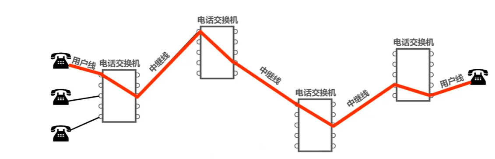
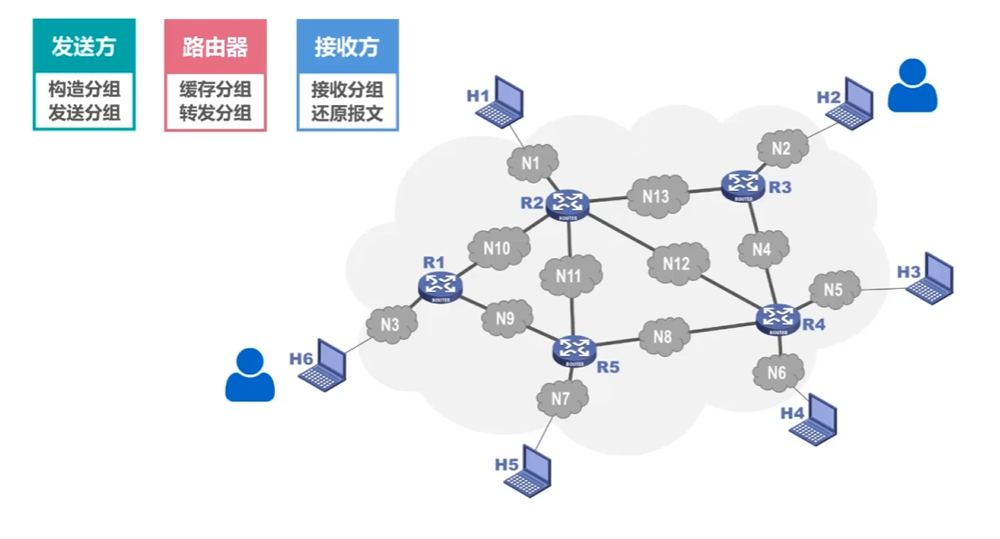
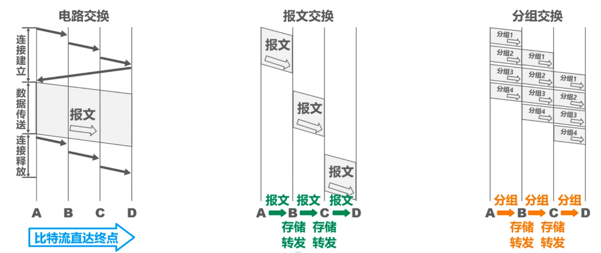

# 计算机网络学习笔记

>@author 24m探照灯
>
>学习视频 [【计算机网络微课堂（有字幕无背景音乐版）】](https://www.bilibili.com/video/BV1c4411d7jb/?p=2&share_source=copy_web&vd_source=cb039403f8464d7a8fb6992f908df6e6) 

---

## 一. 因特网的组成

>- **边缘部分**
>	- **由所有连接在因特网上的主机组成.这部分是用户直接使用的,用来进行通信(传送数据,音频或视频) 和资源共享.**
>- **核心部分**
>	- **由大量网络和连接这些网络的路由器组成.这部分是为边缘部分提供服务的 (提供连通性和交换)**
>
>

---

## 二. 三种交换方式

### 2.1 电路交换 (Circuit Switching)

- **电话交换机连通电话线的方式称为电路交换**
- **从通信资源的分配角度来看,交换 (Switching) 就是按照某种方式动态地分配传输路线的资源**
- **电路交换的三个步骤:**
	1. **建立连接 (分配通信资源)**
	2. **通话 (一直占用通信资源)**
	3. **释放连接 (归还通信资源)**

>当使用电路交换来传送计算机数据时,其线路的传输效率往往很低.因此,计算机网络通常采用分组交换,而不是电路交换

### 2.2 分组交换 (Packet Switching)

### 2.3 电路交换,报文交换,分组交换的对比

#### 优点和缺点

|              | 优点                                                         | 缺点:                                                        |
| ------------ | ------------------------------------------------------------ | ------------------------------------------------------------ |
| **电路交换** | 1) 通信时延小 2)有序传输 3)没有冲突 4)使用范围广 5)实时性强 6)控制简单 | 1)建立连接时间长 2)线路独占,使用效率低 3)灵活性差 4)难以规格化 |
| **报文交换** | 1)无需建立连接 2)动态分配线路 3)提高线路可靠性 4)提高线路利用率 5)提供多目标服务 | 1)引起了转发时延 2)需要较大存储缓存空间 3)需要传输额外的信息量 |
| **分组交换** | 1)无需建立连接 2)线路利用率高 3)简化了存储管理 4)加速传输 5)减少出错概率和重发数据量 | 1)引起了转发时延 2)需要传输额外的信息量 3)对于数据报服务,存在失序,丢失或重复分组的问题; 对于虚电路服务,存在呼叫建立,数据传输和虚电路释放三个过程 |

---

## 三. 计算机网络的定义

- **计算机网络的精确定义并未统一**
- **计算机网络的最简单的定义是:一些互相连接的,自治的计算机的集合**
  - **互连	是指计算机之间可以通过有线或无线的方式进行数据通信**
  - **自治	是指独立的计算机,它有自己的硬件和软件,可以单独运行使用**
  - **集合	是指至少需要两台计算机**
  - **计算机网络的较好的定义是:	计算机网络主要是由一些通用的,可编程的硬件互连而成的,而这些硬件并非专门用来实现某一特定目的 (例如,传送数据或视频信号). 这些可编程的硬件能够用来传送多种不同类型的数据,并能支持广泛的和日益增长的应用**
- **计算机网络所连接的硬件,并不限于一般的计算机,而是包括了智能手机等智能硬件**

---

## 四. 计算机网络的分类

| 按交换技术分类 | *按使用者分类* | *按传输介质分类* |
| :------------: | :------------: | :--------------: |
|  电路交换网络  |     公用网     |     有线网络     |
|  报文交换网络  |     专用网     |     无线网络     |
|  分组交换网络  |                |                  |

| *按覆盖范围分类* | 按拓扑结构分类 |
| :--------------: | :------------: |
|    广域网WAN     |   总线型网络   |
|    城域网MAN     |    星型网络    |
|    局域网LAN     |    环型网络    |
|    个域网PAN     |   网状型网络   |

---

## 五. 计算机网络的性能指标

> **速率**
>
> >**比特**
> >
> >**计算机中数据量的单位,也是信息论中信息量的单位.一个比特就是二进制数字中的一个1或0**
> >
> >**常用数据量单位:**
> >
> >***8 bit = 1 Byte***
> >
> >***==K==B = ==2^10^== B***
> >
> >***==M==B = K•KB = 2^10^ • 2^10^ B = ==2^20^== B***
> >
> >***==G==B = K•MB = 2^10^ • 2^20^ B = ==2^30^== B***
> >
> >***==T==B = K•GB = 2^10^ • 2^30^ B = ==2^40^== B***
>
> **连接在计算机网络上的主机在数字通道上传送比特的速率,也称为比特率或数据率**
>
> **常用数据率单位**
> **bit/s (b/s , bps)**
>
> **==k==b/s = ==10^3^== b/s  (bps)**
>
> **==M==b/s = k • kb/s = 10^3^  • 10^3^ b/s = ==10^6^== b/s (bps)**
>
> **==G==b/s = k • Mb/s = 10^3^  • 10^6^ b/s = ==10^9^== b/s (bps)**
>
> **==T==b/s = k • Gb/s = 10^3^  • 10^9^ b/s = ==10^12^== b/s (bps)**

